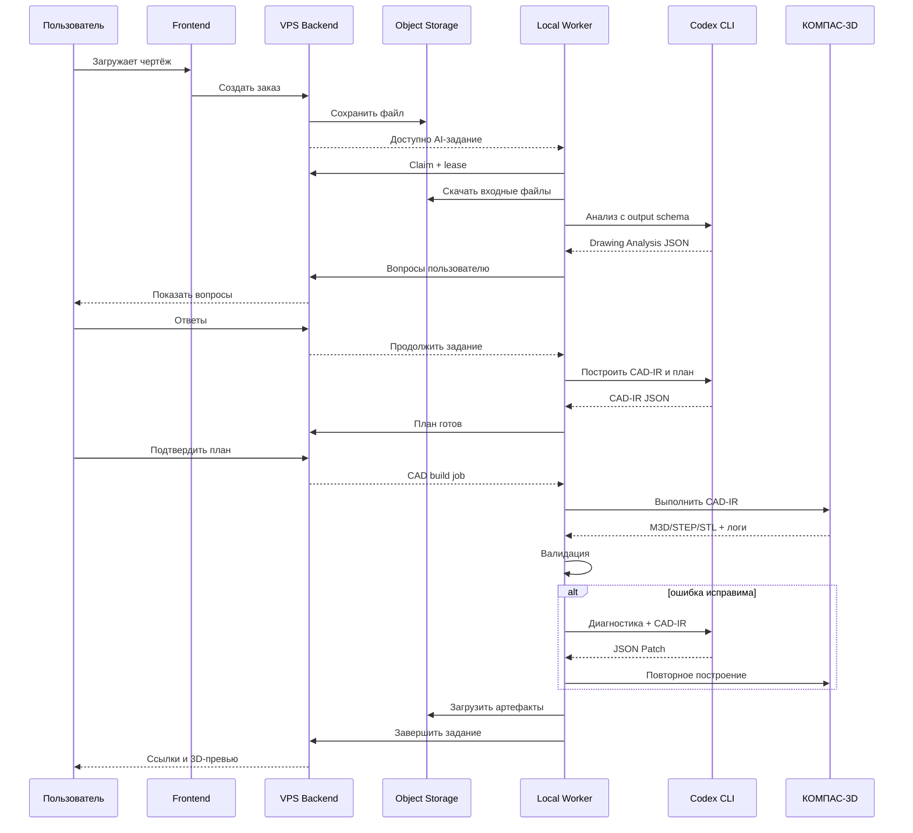

# 02. Системная архитектура

## 1. Компоненты

### VPS

- `web`: Next.js frontend.
- `api`: FastAPI backend.
- `db`: PostgreSQL.
- `redis`: очередь коротких backend-задач, блокировки и кэш.
- `object-storage`: S3-совместимое хранилище, например MinIO на старте.
- `worker-gateway`: WebSocket/long-poll endpoint для локального worker.
- `reverse-proxy`: Caddy или Nginx.
- `background-worker`: Celery, Dramatiq или ARQ для конвертации файлов и уведомлений.

### Локальный Windows-ПК

- `local-agent-service`: Windows Service или пользовательский tray-процесс.
- `job-runner`: скачивает задание, создаёт isolated workspace, ведёт lease.
- `codex-runner`: запускает `codex exec` с выбранным профилем и JSON Schema.
- `kompas-adapter`: детерминированная библиотека операций КОМПАС API.
- `kompas-controller`: запускает, контролирует и завершает экземпляр КОМПАС.
- `geometry-validator`: проверяет M3D/STEP/STL и формирует отчёт.
- `artifact-uploader`: загружает результат на VPS.
- `watchdog`: восстанавливает worker после зависания Codex или КОМПАС.

## 2. Поток данных



## 3. Доверительные границы

### Публичная зона

- браузер пользователя;
- reverse proxy;
- публичный API.

### Серверная доверенная зона

- backend;
- PostgreSQL;
- очередь;
- object storage.

### Локальная высокодоверенная зона

- Codex auth;
- установленный КОМПАС;
- лицензия;
- CAD worker;
- временные оригиналы пользовательских файлов.

VPS не имеет возможности выполнять команду общего назначения на локальном ПК. Он может передавать только задания из закрытого перечисления `job_type`.

## 4. Почему worker делает исходящее соединение

- Не требуется белый IP.
- Не требуется проброс портов.
- Уменьшается поверхность атаки.
- Соединение можно ограничить одним доменом VPS.
- Worker можно отключить одной кнопкой.

## 5. Протокол получения заданий

Для MVP использовать long polling:

```text
POST /api/v1/workers/claim
Authorization: Worker <token>
```

Если задач нет, backend удерживает запрос до 25 секунд. Это проще WebSocket и устойчиво через reverse proxy.

После стабилизации можно перейти на WebSocket для progress events, сохранив HTTP claim как fallback.

## 6. Lease и идемпотентность

Каждое задание имеет:

- `job_id`;
- `order_id`;
- `attempt`;
- `idempotency_key`;
- `lease_owner`;
- `lease_expires_at`;
- `heartbeat_at`.

Worker продлевает lease каждые 20 секунд. Если heartbeat отсутствует, backend возвращает задание в очередь только после истечения lease. Перед повторным запуском worker проверяет, не загружены ли уже артефакты с тем же idempotency key.

## 7. Репозитории

Для MVP рекомендуется monorepo:

```text
/apps/web
/apps/api
/apps/local-worker
/packages/contracts
/packages/cad-ir
/packages/kompas-adapter
/packages/geometry-validation
/infra
/docs
/tests/fixtures
```

Преимущества: единые контракты, один issue tracker, синхронные изменения протокола.

## 8. Выбранный стек

### VPS

- Python 3.13+
- FastAPI
- SQLAlchemy 2
- Alembic
- PostgreSQL 16+
- Redis 7+
- Next.js 15+
- TypeScript
- MinIO или внешний S3
- Docker Compose
- Caddy

### Windows

- .NET 8 LTS либо актуальная поддерживаемая версия
- C# для Windows Service и COM-адаптера
- Python только для вспомогательных геометрических утилит при необходимости
- Codex CLI 0.144.0 или новее для GPT-5.6
- КОМПАС-3D с установленным SDK и доступной 3D-лицензией

Версии должны быть закреплены в lock-файлах и документированы в `versions.lock.md`.
